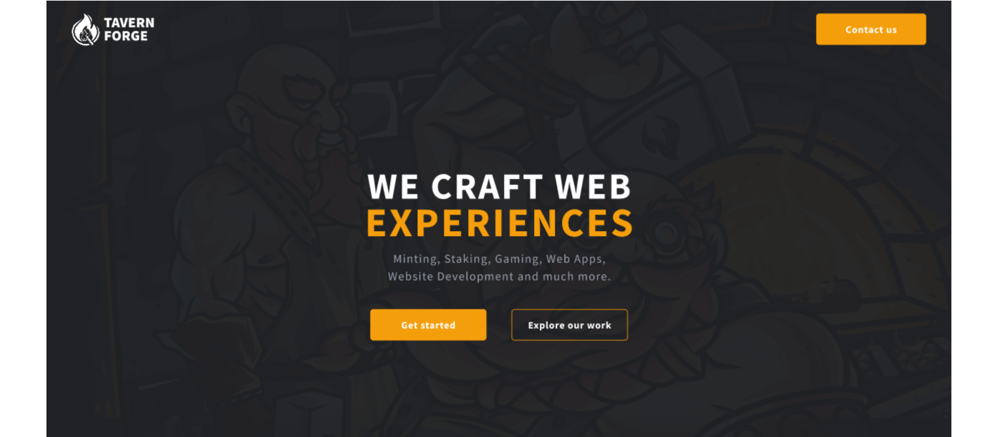

# Tavern Forge Web Experiences



## Table of Contents

- [Introduction](#introduction)
- [Features](#features)
- [Tech Stack](#tech-stack)
- [Installation](#installation)
- [Usage](#usage)
- [Contributing](#contributing)
- [License](#license)
- [Contact](#contact)

## Introduction

Tavern Forge Web Experiences is a web application that showcases a collection of logos in a rotating carousel. Built with Next.js, Tailwind CSS, and Shadcn, this project demonstrates modern web development practices, including responsive design, dynamic content loading, and smooth animations.

## Features

- Responsive design with Tailwind CSS
- Image carousel using `react-slick`
- Retina-ready images
- Custom grayscale and hover effects
- Background image and animated carousel

## Tech Stack

- Next.js
- Tailwind CSS
- React Slick
- Shadcn

## Installation

To get started with the project, follow these steps:

1. **Clone the repository:**

    ```bash
    git clone https://github.com/adelodundamilare/tavern.git
    cd tavern
    ```

2. **Install dependencies:**

    ```bash
    npm install
    ```

3. **Run the development server:**

    ```bash
    npm run dev
    ```

    Open [http://localhost:3000](http://localhost:3000) in your browser to see the result.

## Usage

After setting up the project, you can customize the logos and content by editing the `Logos` component in `components/logos.js`. The carousel settings can be adjusted in the same file.

### Adding New Logos

To add new logos, update the `logos` array in `components/logos.js`:

```javascript
const logos = [
  {
    src: "/images/your-new-logo.png",
    alt: "New Logo",
    srcSet: "/images/your-new-logo@2x.png 2x, /images/your-new-logo@3x.png 3x",
  },
  // Add more logos here
];
```

## Contributing

Contributions are welcome! If you have any ideas, suggestions, or improvements, feel free to open an issue or create a pull request.

1. Fork the repository
2. Create your feature branch (`git checkout -b feature/new-feature`)
3. Commit your changes (`git commit -m 'Add some feature'`)
4. Push to the branch (`git push origin feature/new-feature`)
5. Open a pull request

## License

This project is licensed under the MIT License. See the [LICENSE](./LICENSE) file for details.

## Contact

If you have any questions or feedback, feel free to reach out:

- Email: adelodundamilare@gmail.com
- GitHub: [adelodundamilare](https://github.com/adelodundamilare)
